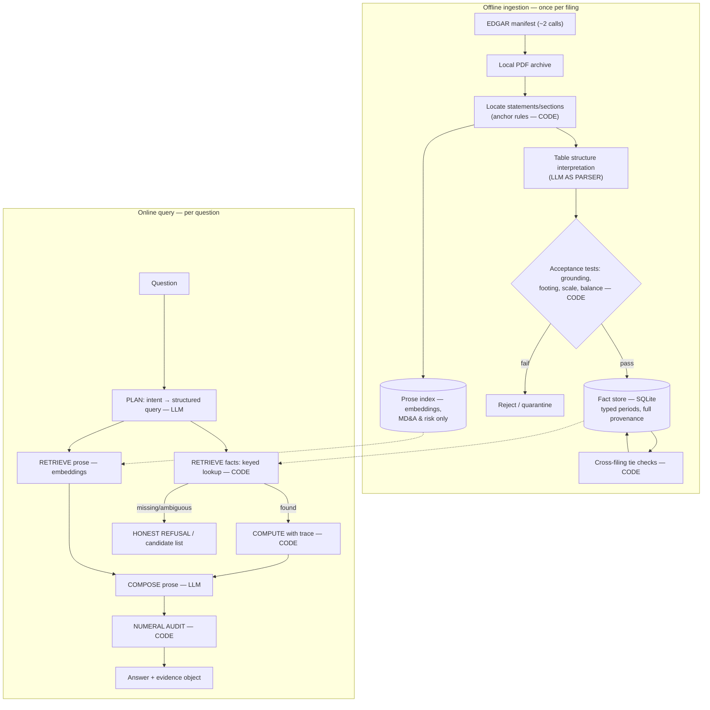

# SEC Filing Intelligence — Architecture

**Status:** Design phase. DESIGN.md (detailed component design) and implementation follow.

**One-sentence summary:** We parse a small set of PDF filings *once* into a deterministically verified store of financial facts, answer numeric questions by keyed lookup and code-based arithmetic (never by embedding search or LLM math), use the LLM only where language understanding is genuinely required, and attach a complete evidence trail to every number so a skeptical finance user can check it in under a minute.

The predecessor system failed four specific ways: **hallucinated values, mixed annual/quarterly numbers, GAAP/non-GAAP confusion, no traceability.** Every design decision here is justified against one question: *does it make one of those failure modes structurally impossible, detectable, or honestly disclosed?* None is addressed by "prompt the model to be careful." The organizing principle throughout: **every LLM output is either checked by deterministic code or disclosed as unchecked.**

---

## 1. Assumptions and scope

### 1.1 Key ambiguities and our calls

| Ambiguity | Our call |
|---|---|
| "PDFs purchased in bulk" — the SEC doesn't actually sell a PDF archive | We simulate it: download 6 filings, render to PDF, then treat them as **opaque PDFs**. The pipeline never peeks at HTML/XBRL. |
| EDGAR "low daily budget" unquantified | Design to ≤100 calls/day; actually use ~2 (manifest) + ~10–20 one-time (benchmark ground truth). **Zero at question time.** |
| "Net income growth 2025→2026" — FY2026 hasn't ended (it's July 2026) | Treated as an honesty test: the system says "not filed yet" and offers the nearest answerable variant (Q1'26 vs Q1'25). |
| "2025" / "Q1" — calendar or fiscal? | Fiscal, as reported. Every answer prints concrete period start/end dates so the interpretation is visible. |
| GAAP vs non-GAAP | Numeric facts come **only from the three primary financial statements** — GAAP/non-GAAP confusion becomes structurally impossible, not probabilistically unlikely. Non-GAAP mentions in prose are quoted and labeled, never computed on. |

Minor calls, one line each: growth = (Y−X)/|X| with sign conventions disclosed; amendments preferred and conflicts flagged as restated; artifact is CLI/notebook (the rubric discounts polish); latency "interactive, not real-time," which licenses the parse-once design.

### 1.2 Deliberate scope cuts (decisions, not omissions)

| Cut | Decision | Why this cut |
|---|---|---|
| Companies | **Tesla + Apple** | Tesla is the exercise's example. Apple is chosen *because* its fiscal year ends in September — forcing the period-normalization machinery to be real, not decorative. |
| Filings | **6, deliberately overlapping** (TSLA FY25 10-K, Q1'26 + Q1'25 10-Qs; AAPL FY25 10-K, FQ2'26 + FQ2'25 10-Qs) | Each company gets an overlapping quarter pair: prior-year figures reappear as comparative columns in the newer 10-Q, powering the cross-filing consistency check (§5). The pair matters most for the one error the acceptance tests can't catch — a clean period-column swap (weakness #1) — which would otherwise go undetected for whichever company lacked the overlap. |
| Statements | Three primary statements only; no segments, footnotes | Covers every in-scope metric, structurally excludes non-GAAP; footnotes are where parsing cost explodes for marginal coverage. |
| Metrics | Curated dictionary of **~18 canonical concepts** (revenue → EPS → cash flows) | Answers every in-scope example question incl. derived ones. Hand curation is the honest prototype form of what becomes a learned mapping at scale (§8). |
| Questions | Numeric lookup, derived metrics, narrative quotes. No forecasting, screening, segments, OCR | Numeric questions are the trust-critical path and get the strongest guarantees; narrative gets weaker guarantees, stated as such. |

Out-of-scope questions get an explicit refusal with the reason — a trust feature we demonstrate, not a gap.

---

## 2. System overview

Two halves with different risk profiles: an **offline ingestion pipeline** (once per filing, converts PDFs into a verified store) and an **online query workflow** (plan → retrieve → compute → compose → audit, with refusal as a first-class outcome).



**Where the LLM is and isn't:**

| Stage | LLM? | Why |
|---|---|---|
| Locating statements in the PDF | No | Anchor phrases ("CONSOLIDATED STATEMENTS OF OPERATIONS") are reliable and auditable. |
| Interpreting table **structure** | **Yes** | Genuine layout understanding across inconsistent formats — the one ingestion task where rules are brittle. Output is untrusted until it passes acceptance tests (§4.3). |
| Admitting values to the store | No | **The LLM proposes; code disposes.** |
| Parsing the user's question | **Yes** | Language understanding. The interpreted query is echoed back so misreads are visible. |
| Finding the fact | No | Keyed lookup. Embeddings deliberately excluded (§4.2). |
| Arithmetic | **Never** | §4.4. |
| Composing prose | **Yes** | Fluency; safety comes from the numeral audit (§5.3), not trust. |
| Narrative retrieval (MD&A) | Embeddings | The one place semantic search fits: prose. |

**Parse-once vs. interpret-per-question** (the exercise's own framing question): parse-once, for three reasons. (1) Verification composes only across a corpus — cross-filing tie checks need facts from multiple filings in one store. (2) The riskiest step should run once, cold, and be inspectable; parse-once turns extraction errors into findable data bugs, parse-per-question turns them into intermittent hallucinations in front of the user. (3) It's the only shape that survives 30k filings. The rejected live-PDF-reader alternative is essentially what the failed predecessor did.

---

## 3. Data pipeline

**Stage 0 — Filing manifest.** One `submissions` call per company (2 total) records accession numbers, form types, filing dates, **fiscal period end dates**, and each company's fiscal calendar. This is the system's ground truth for what exists and what periods mean — the highest-leverage 2 API calls available, vs. the weaker alternative of parsing cover pages.

**Stage 1 — Segmentation (deterministic).** From the PDF text layer, locate the three primary statements via anchor phrases and narrative sections (Item 1A, MD&A) via item-heading patterns. Pure rules: these anchors are among the few genuinely reliable regularities in SEC filings.

**Stage 2 — Table extraction: LLM as parser, code as gatekeeper.** The LLM receives page text with layout hints and returns a candidate table: rows (raw label + one value per period column), its reading of column headers, and the scale declaration. **Nothing it returns is trusted** — every cell must pass §4.3's acceptance tests; statements with too many failures are quarantined, not partially ingested. Rejected alternatives: rule-based parsers (Camelot/Tabula — lattice/whitespace assumptions break on borderless multi-header financial statements, and per-format rules are exactly the scaling liability §8 avoids); cloud doc-AI (outsources the evaluated problem, errors equally opaque, we'd still need the same acceptance tests); unchecked LLM extraction (the predecessor's mistake with extra steps).

**Stage 3 — The fact store (SQLite).** Each accepted cell becomes a fact:

```
fact(company, concept, raw_label, period_start, period_end,
     duration_type,          -- INSTANT | QUARTER | YTD | FISCAL_YEAR  ← typed
     value_raw,              -- as printed: "(1,204)"
     value_normalized, unit, scale,
     accession_no, form_type, filing_date, amended,
     page, statement, row_index, verification_status)
```

Three design points carry the trust load: **periods are typed dates, never strings** — "Q1" is resolved through the fiscal calendar, and the compute layer refuses cross-duration arithmetic, making annual/quarterly mixing a type error; **the raw printed label always travels with the fact**, so a wrong canonical mapping is visible to the user; **the same economic fact stores one provenance record per filing it appears in** — the raw material for tie checks. Narrative sections go to a separate prose index (embedded, page-cited); prose never yields computable facts.

**Why SQLite, not a vector DB, for facts:** a financial fact is a key-value lookup — (company, concept, period, duration) is a natural composite key. A vector DB answers "what is *similar*," which is precisely the wrong question when "Net income" and "Net income attributable to common stockholders" must not be confused. Similarity is the failure mode here, not the feature.

**EDGAR budget ledger:** ~2 calls (manifest) + ~10–20 one-time (XBRL spot-checks validating the *benchmark*, §6) + **0 per question** — an answer path leaning on the API is a design that can't ship against a tens-of-thousands-of-PDFs archive premise.

---

## 4. Numeric retrieval & extraction (Functional Expectation #5)

This determines whether the rest can be trusted, so it gets the full argument.

### 4.1 Finding a number is not search

1. The planner LLM converts the question to a structured query: `{company: TSLA, concept: net_income, periods: [FY2025, FY2024], operation: growth}`.
2. Code resolves period aliases through the fiscal calendar into typed dates.
3. Code looks up facts by exact key.
4. On a miss, a **fuzzy label fallback** (string similarity against raw labels within the right statement) proposes candidates. Two+ survivors → the candidate list *is* the answer. Exactly one survivor → used, but never silently: the evidence object records `match_method: label_similarity` and the answer carries the caveat "matched by label similarity, not the curated dictionary — verify the printed label." A lone fuzzy match is a one-candidate guess, not a dictionary hit.

The hard interpretive work happened once at ingestion, under acceptance tests. Question-time retrieval is boring on purpose: boring is auditable.

### 4.2 Why embeddings are excluded from this path

An embedding model is trained — typically contrastively — to place *topically similar* text near each other. Three consequences are fatal for table lookup:

1. **Near-identical labels collapse.** "Net income" and "Net income attributable to common stockholders" share almost all tokens and topic; their vectors land nearly on top of each other — yet they are *different accounting concepts* (the latter nets out noncontrolling interests and preferred dividends), sitting rows apart with different values. The training objective actively *rewards* erasing the one distinction we most need. (During implementation we'll embed this exact pair and cite the measured cosine — a number we measured beats one we borrowed.)
2. **Numbers don't embed as magnitudes.** Digits tokenize as arbitrary text; the vector for "96,773" encodes "a number in a revenue-ish context," not the quantity.
3. **Linearization destroys table geometry.** A cell's meaning is its (row label, column header, scale note) — 2-D relationships that chunking flattens; the vector loses "this belongs to the *Three Months Ended March 31, 2026* column."

Embeddings **are** used for narrative questions ("what did management say about margin pressure?") because there the objective matches the task. Same tool, opposite fit — decided per content type by whether the target's identity survives the similarity function.

### 4.3 Deterministic acceptance tests at ingestion

No value enters the store unless it passes:

1. **Grounding check (anti-hallucination, absolute):** the value's exact printed character sequence must exist in the source page's text layer **as a whole token** (so `1,204` can't hide inside `11,204`), within the located statement's page range. An invented number has no coordinates on a page, so fabrication cannot reach storage. Honest limit: this proves the digits exist, not that they were attached to the right row — that's what the remaining checks are for.
2. **Footing checks:** printed subtotal structure must hold (components sum to "Total operating expenses," etc.). A wrong row-association almost always breaks a sum. Honest cost: footing relationships are per-company curated structure — part of the same hand-curation surface as the dictionary (weakness #3), not a free property of financial statements.
3. **Balance-sheet equation:** assets = liabilities + equity, as printed.
4. **Scale sanity:** normalized magnitude must be plausible for the concept — catches the classic silent ×1000 error from a misread scale declaration.

### 4.4 Arithmetic: deterministic code, never the LLM

Every growth rate, margin, and delta is computed by code that emits a step-by-step trace:

```
net_income FY2025 (10-K acc. …, p.23, "Net income")  =  $8,419M
net_income FY2024 (same filing, comparative column)   =  $7,091M
growth = (8,419 − 7,091) / 7,091 = 0.1873 → 18.7%
```

Two reasons, in order: (1) **Mechanism** — LLMs produce digits by next-token prediction; multi-digit arithmetic means simulating carrying/long division across a tokenization not built for it, degrading with operand length and worst for division/percentages — exactly what growth rates are, on 5–7 digit values riding a ×10⁶ scale, where unit slips produce *plausible-looking* wrong answers. (We'll spot-test the model on real SEC-scale operands during implementation and bring the observed error rate to the walkthrough.) (2) **The deeper reason: auditability.** Even a correct LLM computation is unverifiable text; a code-emitted trace is checkable by construction. **We would compute in code even if LLM arithmetic were perfect** — verifiability is the product. Ranking questions ("which metrics deteriorated most?") are likewise code-computed; the LLM only narrates the sorted table it's handed.

### 4.5 Retrieval quality ≠ answer correctness

A pipeline can find exactly the right table and still read the wrong column (period), row (near-miss label), or scale. Correctness therefore rests on mechanisms that don't trust retrieval: the acceptance tests above, cross-filing tie checks (§5.2), XBRL spot-checks, and — the only end-to-end measure — the benchmark (§6), which scores final answers and logs "right table, wrong cell" separately so the divergence is visible rather than assumed away.

---

## 5. Trust & traceability

### 5.1 Four failure modes, four named guards

| Predecessor failure | Guard | Class |
|---|---|---|
| Hallucinated values | Grounding check (§4.3) at ingestion; numeral audit (§5.3) at output | Structurally impossible at both ends |
| Annual/quarterly mixing | Typed periods; compute layer refuses cross-duration arithmetic; concrete dates printed | Type error, not judgment call |
| GAAP/non-GAAP confusion | Facts only from primary statements; non-GAAP prose quoted and labeled | Excluded by ingestion scope |
| No traceability | Evidence object on every answer; showing work is the default | Product invariant |

### 5.2 The evidence object

Every numeric answer carries, machine-readable and rendered:

- **Interpreted question** — the planner's structured reading, echoed back. This is the guard on the one LLM step with no deterministic test: a misparse is immediately visible.
- **Facts used** — filing (form, accession, date), page, statement, label *as printed*, typed period, raw and normalized values, scale.
- **Calculation trace** — every step, exactly as computed.
- **Verification status** — `VERIFIED` (independently corroborated — e.g., the same value appears as a comparative column in another filing, or participates in a passing footing sum), `UNVERIFIED` (passed ingestion, no independent confirmation), or `CONFLICTING` (sources disagree — e.g., restated; both shown).
- **Caveats** — near-miss alternatives that existed, fiscal-calendar notes, unaudited status of 10-Q data, fuzzy-match disclosure.

The **cross-filing tie check** is the closest PDF-land substitute for XBRL's free correctness: the filing set was chosen so key figures appear in ≥2 independently parsed documents. Agreement to the digit is strong evidence extraction is right; disagreement is a parsing bug or a restatement, and both deserve a flag. This check gets *stronger* with corpus size (§8).

### 5.3 Last line of defense: the numeral audit

The composing LLM paraphrases numbers ("about $8.4B", silent rounding, digit transposition). After composition, code extracts every numeral token and **classifies before checking** — a naive "every numeral must be in the trace" rule would reject every answer: **value tokens** must match the evidence object exactly or as a declared rounding; **period tokens** (FY2025, dates) must match the evidence object's period metadata; **provenance tokens** (pages, accessions) must match provenance fields; **anything unclassifiable fails** — the default is rejection, not exemption. A failed audit regenerates the composition or falls back to a deterministic template. The LLM writes the sentences; it cannot introduce a number of any kind.

### 5.4 Honest uncertainty as a first-class output

Refusal is an advertised behavior, not an error handler: **missing data** ("FY2026 not filed as of 2026-07-11 — nearest answerable: Q1'26 vs Q1'25, want that?"); **out of corpus** ("Microsoft is not ingested; no answer attempted"); **ambiguous concept** (candidate list, user picks); **conflicting sources** (both values, both filings, restatement note); **unverified facts** (answered, but labeled). Wrong-but-confident destroyed trust last time; each of these trades apparent capability for verifiability on purpose.

### 5.5 Build priority (what DESIGN.md inherits)

| Tier | Guards | Rationale |
|---|---|---|
| **P0 — no trust story without them** | Grounding check; typed periods + cross-duration refusal; deterministic arithmetic with trace; evidence object; refusal paths; scale normalization; balance-sheet equation; concept dictionary; the benchmark | Each directly guards a named predecessor failure or measures everything else. |
| **P1 — hardening, in this order if on schedule** | Footing checks; numeral audit; candidate lists + fuzzy caveats; cross-filing tie check in minimal form (agreement/conflict flag on the ~dozen overlapping facts) | Converts "unlikely" into "checked" — without the full status-propagation machinery. |
| **P2 — designed, not built** | Restatement preference logic (schema supports it); quarantine review tooling; three-state verification display (collapses to corroborated y/n if P1 lands) | The schema shows the thinking; building behavior the 5-filing corpus may never exercise is bad prototype spend. |

If the interviewer asks "what did you cut and why" — this table.

---

## 6. Evaluation plan

**~25 hand-verified Q/A pairs**, built by reading the actual PDFs and recording expected values, exact page/table/label, and expected behavior class. Small and defensible line-by-line beats large and assumed.

| Category | ~N | Catches |
|---|---|---|
| Direct lookups | 8 | Extraction + period resolution |
| Derived metrics (growth, margins) | 6 | End-to-end computation trace |
| Quarterly YoY | 3 | Duration typing, cross-filing lookup |
| **Period traps** (fiscal-vs-calendar; not-filed-yet) | 3 | Honest calendar handling, refusal quality |
| **Label traps** (net income vs. attributable-to-common) | 2 | Near-miss guard |
| **Scale trap** (per-share next to millions) | 1 | Scale normalization |
| **Should-refuse** (out-of-corpus; segments) | 2 | Refusal precision — refuses *and only* refuses when it should |

**"Correct" is defined before running:** extraction is correct only if value ∧ line item ∧ period all match — a right number from the wrong row is wrong. Computation must match hand recomputation at full precision (only presentation rounding tolerated; reading a printed number has no measurement noise, so no tolerance band). **A right answer with a wrong citation fails** — verifiability is the promise. Spurious refusals fail too — a system refusing everything is trivially safe and useless. Every failure is classified by which guard leaked, and retrieval-vs-answer divergence is logged as direct evidence for §4.5. A ~10-question sample of the hand-derived ground truth is itself cross-checked against XBRL — guarding against the human verifier misreading the PDF.

---

## 7. Known weaknesses (candid)

1. **Table-structure interpretation is the load-bearing LLM step, and some layouts will beat it.** Acceptance tests catch most wrong-value outcomes, but not all: a clean swap of two period columns passes every sum. The tie check is the main net under that — and only for figures appearing in ≥2 filings.
2. **The grounding check proves existence, not association.** Right-digits-wrong-cell is the residual hallucination-adjacent risk; footing/balance/tie checks shrink it, but not to zero.
3. **The dictionary — and the footing rules riding on it — are hand-made for two companies.** Banks, insurers, REITs, or even a third industrial with idiosyncratic labels require new entries *and* new footing structure. Wider curation boundary than "dictionary" suggests; scaling path in §8.
4. **The planner LLM has no deterministic test.** A misparsed question yields a well-cited answer *to the wrong question*. Mitigation is the interpreted-question echo — which requires the user to read it. The next guard to build (e.g., confirm step for high-stakes queries).
5. **The narrative path has categorically weaker guarantees.** Quotes are verbatim with page cites, but semantic retrieval can miss the best passage. Numeric claims are barred from this path, containing but not eliminating the damage.
6. **Period logic covers common shapes only.** 53-week years, transition periods, and stub periods are not modeled; Apple's retail calendar is handled only to "print the exact dates."
7. **Restatement handling is schema-deep, experience-shallow** — designed, likely never exercised against a real restatement in 6 filings (though Tesla’s FY2025 10-K/A — a routine Part III amendment — is recorded in the manifest as a live example of amendment handling).
8. **Single-parse dependency.** `UNVERIFIED` facts rest on one LLM parse plus ingestion checks; the label is honest, but users may not weigh it.
9. **No OCR → silent scope edges.** An image-rendered table yields "not found" for data a human can see.

---

## 8. Scaling path: tens of thousands of filings (roadmap, not built complexity)

In the order things break:

1. **LLM parsing cost/throughput breaks first.** Fine ×5, untenable ×30k as serial per-document spend. Fix is *earned determinism*: cluster filings by layout (issuer + filer-agent formats repeat heavily), promote LLM interpretations of dominant clusters into validated deterministic template parsers, keep the LLM for the long tail and drift detection. Batch queue, parser versioning, parse-on-demand prioritization.
2. **The dictionary breaks with the third company, not the ten-thousandth filing.** Fix: bootstrap label→concept mapping from the SEC's *bulk* structured data (XBRL label linkbases, Financial Statement Data Sets — downloadable files, outside the API limit), with a human review queue for low-confidence mappings and industry-specific concept sets.
3. **Storage/indexing:** facts to Postgres (schema is already relational — a lift, not a redesign), PDFs to object storage, prose embeddings to a real ANN index. Fact volume itself is trivial (low millions of rows); documents and embeddings are what need infrastructure.
4. **Verification gets *better* at scale:** cross-filing redundancy grows with the corpus — most income-statement figures eventually appear in 3+ filings, so tie-checking becomes the dominant, nearly free correctness signal. Needs a job DAG and fact versioning.
5. **Evaluation:** stratified-sampled benchmark using the bulk Data Sets as silver labels, human-verifying disagreements; run as a regression suite on every parser version bump.

**What deliberately does not change:** the shape. Parse-once, keyed lookup, deterministic arithmetic, evidence objects — the trust model was chosen because it survives scale; only the machinery under each stage industrializes.

---

## 9. Product fit

**The right user today is the analyst, not the executive.** The predecessor failed with users who consume answers without verifying. This system targets the financial analyst who currently spends 20 minutes finding the table and building the comparison, and is professionally obligated to verify anyway: for them the product is "a draft with a pre-assembled verification trail," turning the 20-minute lookup into a sub-minute check — and the refusal behaviors that would frustrate a casual user mirror judgment calls the analyst already makes. Executives get answers *through* the analyst — the existing trust chain, accelerated. Earning the direct-to-executive seat is a roadmap outcome driven by measured benchmark accuracy, not a launch premise.

**Missing before enterprise deployment** (distinct from §8's scale work — these gaps exist even at 6 filings): access control and audit logging of Q&A (decision provenance is a compliance artifact even over public filings); a dispute/feedback loop routing caught errors into the benchmark and dictionary; model/parser governance so any answer is reproducible after the fact; an evidence-review UI that highlights the cell on the source page; coverage stated *inside the product* so "not in corpus" is an expected boundary; vendor review — question text itself reveals strategy (which companies leadership studies) even when the filings are public. None change the architecture; all sit between "convincing prototype" and "thing a Fortune 500 relies on."

---

## 10. Decision log (interview talking points)

**Walkthrough plan (5–10 min):** the spoken spine is decisions **1 → 2 → 4 → 7 → 12**, told as one story — *every LLM output is either checked by code or disclosed as unchecked.* The rest is depth-on-demand. Demo sequencing: six of the exercise's eight example companies are out of corpus by deliberate scope, so lead with in-corpus questions — the period-trap and label-trap cases are the strongest material — then show **one refusal on purpose**, framed as the trust feature it is.

| # | Decision | Rejected | One-breath rationale |
|---|---|---|---|
| 1 | Parse once into a verified fact store | Per-question live PDF reading | Verification composes across a corpus; riskiest step runs once, inspectable; only shape surviving 30k filings. The predecessor did the alternative. |
| 2 | Keyed lookup for numbers | RAG/embeddings over table chunks | The training objective erases the exact distinction we need ("net income" vs. "attributable to common"). Similarity is the failure mode, not the feature. |
| 3 | Embeddings for MD&A prose only | One retrieval mechanism for all | Prose is the task embeddings are trained for; tables aren't. Fit decided per content type. |
| 4 | LLM interprets structure; code accepts every value | Rule parsers; cloud doc-AI; unchecked LLM | Rules brittle per format; services outsource the evaluated problem and still need the same checks; unchecked LLM is the predecessor's mistake. |
| 5 | Grounding check: printed characters must exist on the page (whole-token) | Trusting extraction confidence | Fabrication structurally cannot enter storage — a guarantee, not a probability. Limit: existence ≠ right row (→ #6). |
| 6 | Footing/balance/tie checks + typed periods | "The parse looked right" | Wrong associations break printed sums; duration typing makes annual/quarterly mixing a type error; cross-filing agreement is PDF-land's XBRL substitute. |
| 7 | All arithmetic in code, with emitted trace | LLM computes | Digit-token arithmetic degrades on SEC-scale operands — and even a *correct* LLM computation is unauditable text. We'd use code even if LLM math were perfect. |
| 8 | Numeral audit on composed answers | Trusting the composition prompt | The LLM writes sentences but cannot introduce a number. Defense-in-depth pair with #5. |
| 9 | Facts only from primary statements | Ingesting MD&A/press-release tables | GAAP/non-GAAP confusion becomes structurally impossible. Cheap to state, huge trust payoff. |
| 10 | Tesla + Apple, 6 filings as overlapping quarter pairs | Two calendar-year companies, disjoint filings | Apple's September year-end forces real fiscal logic; overlap makes the tie check demonstrable. |
| 11 | ~2 + ~10–20 one-time EDGAR calls; 0 at query time | Live XBRL on the answer path | The archive premise forbids API dependence; budget spent knowing what exists and checking our checker. |
| 12 | Refusal/candidate-list as first-class outputs | Always answering something | Wrong-but-confident is what killed trust. "Not filed yet" is a correct answer, and the benchmark scores it. |
| 13 | 25 hand-verified Q/A incl. traps; correct = value ∧ line item ∧ period ∧ citation | Big unverified eval; retrieval metrics as proxy | Retrieval quality ≠ correctness (right table, wrong cell). An eval defensible line-by-line beats one assumed. |
| 14 | SQLite + CLI | Postgres, vector-DB facts, web UI | Prototype-honest; the rubric discounts polish; §8 names when each upgrade earns its keep. |
