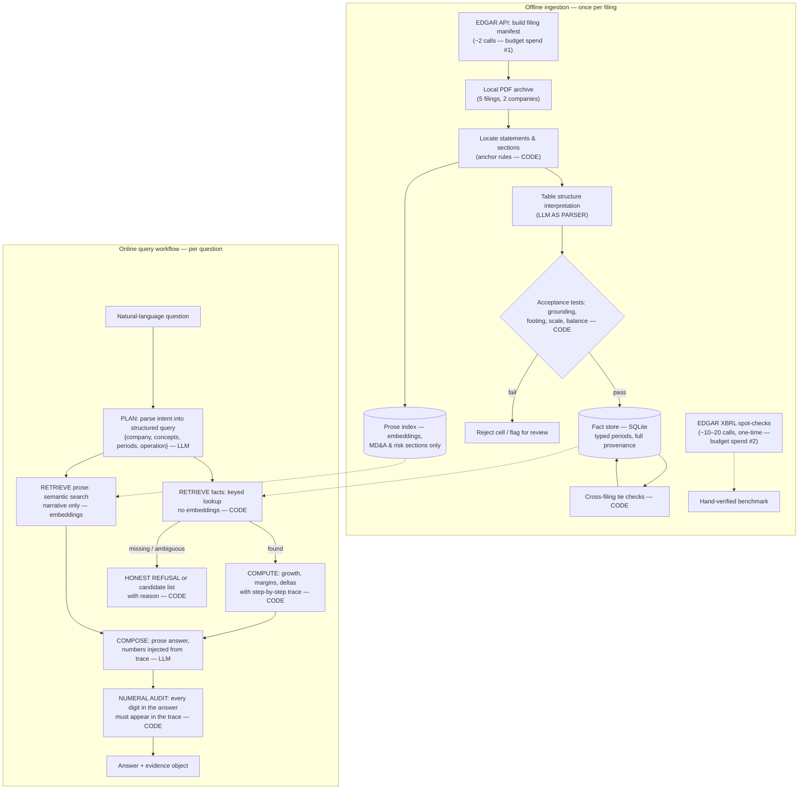

# SEC Filing Intelligence — Architecture

**Status:** Design phase. This document is the architecture deliverable. A detailed component design (DESIGN.md) and implementation follow in later phases.

**One-sentence summary:** We parse a small set of PDF filings *once* into a deterministically verified store of financial facts, answer numeric questions by keyed lookup and code-based arithmetic (never by embedding search or LLM math), use the LLM only where language understanding is genuinely required, and attach a complete evidence trail to every number so a skeptical finance user can check it in under a minute.

---

## 1. Problem framing, assumptions, and deliberate scope cuts

### 1.1 What problem we are actually solving

The client's previous AI assistant failed in four specific ways: it **hallucinated values**, it **mixed annual and quarterly numbers**, it **confused GAAP and non-GAAP metrics**, and it gave answers **without traceability**. The bar is not "can it answer questions" but *"can we trust the answer enough to make decisions from it."*

Every architectural decision in this document is therefore justified against one question: **does it make a specific failure mode structurally impossible, detectable, or honestly disclosed?** Each of the four failure modes gets a named, mechanical guard (summarized in §5.1); none is addressed by "prompt the model to be careful."

The second defining constraint is data reality: **the primary corpus is PDF filings**, not the pre-tagged XBRL the EDGAR API hands out. The hard problem — knowing what a number *means* when no structured tag tells you — must be solved from the document itself. The live EDGAR API is treated as a rationed resource and is never on the answer path (§3.4).

### 1.2 Ambiguities in the exercise and our explicit assumptions

The exercise is deliberately ambiguous in places. Rather than silently picking interpretations, we list every ambiguity we found and the assumption we made:

| # | Ambiguity in the exercise | Our assumption / decision |
|---|---|---|
| A1 | "PDFs purchased in bulk from SEC" — EDGAR actually serves filings as HTML/XBRL; the SEC does not sell a PDF archive. | We simulate the archive: download 5 filings, render/save them as PDFs, and from that point treat them as **opaque PDFs**. The pipeline never peeks at the underlying HTML or inline XBRL. XBRL is used only for a handful of benchmark ground-truth spot-checks (§6), within the API budget. |
| A2 | "Low daily call budget" for EDGAR is never quantified. | We design to **≤100 requests/day**, and actually plan to use far fewer (~2 for filing discovery, ~10–20 one-time for benchmark validation). Zero calls at question time. |
| A3 | Example questions span 8 companies (Tesla, Apple, Microsoft, Amazon, NVIDIA, Google, Meta, Netflix), but the suggested scope says 1–2 companies. | We scope to **2 companies** (§1.3). Questions about out-of-corpus companies get an honest, explicit refusal — which is itself a trust feature we want to demonstrate, not a gap. |
| A4 | "Net income growth between 2025 and 2026" — as of today (July 2026), fiscal 2026 has not ended for a calendar-year filer, so no FY2026 10-K exists. | The system detects "period not filed yet," says so, and offers the nearest answerable variant (e.g., Q1 2026 vs. Q1 2025). We treat this example question as a deliberate honesty test, not something to fudge. |
| A5 | Does "2025" mean calendar year or fiscal year? Apple's FY2025 ended in September 2025. | Default interpretation is the **fiscal year as reported in the filing**. Every answer prints the actual period start/end dates so the user sees exactly which months are covered. One of our two companies is chosen specifically because its fiscal year is *not* the calendar year, to force this logic to exist (§1.3). |
| A6 | Does "Q1" mean calendar Q1 or fiscal Q1? | Fiscal quarter as reported. Same disclosure rule: dates always shown. |
| A7 | Are segment-level questions (e.g., "Amazon's AWS revenue") in scope? | Out of scope for the prototype. Segment tables have different structure (footnote-style disclosures) and would double parsing scope for one question type. The system refuses with the reason. |
| A8 | How should amended filings (10-K/A) be handled? | The filing manifest records amendment status; the store prefers the latest amendment and flags any value that differs from the original as **restated**, showing both. (With only 5 recent filings we may not encounter one; the schema supports it regardless.) |
| A9 | GAAP vs. non-GAAP: 10-K/10-Qs' primary financial statements are GAAP; non-GAAP figures mostly appear in MD&A and earnings releases (8-K). | The numeric fact store ingests **only the three primary financial statements** (income statement, balance sheet, cash flow). This makes GAAP/non-GAAP confusion structurally impossible for numeric answers rather than probabilistically unlikely (§5.1). Non-GAAP mentions in prose are surfaced as quotes with labels, never as computable facts. |
| A10 | "Growth between X and Y" formula. | Standard relative change: (Y − X) / |X|, shown explicitly in the calculation trace. Sign conventions for negative bases are disclosed in the answer when they apply. |
| A11 | Artifact format is open (chat UI, CLI, notebook…). | CLI / notebook. The audience is a technical interview walkthrough; a UI adds polish the rubric explicitly discounts. Final choice deferred to DESIGN.md. |
| A12 | Latency expectations are unstated. | Interactive but not real-time (~seconds). This licenses the parse-once design: all heavy work happens at ingestion, queries hit a local store. |

### 1.3 Deliberate scope cuts (decisions, not omissions)

| Cut | Decision | Why this cut and not another |
|---|---|---|
| Companies | **Tesla + Apple** | Tesla is the exercise's own example. Apple is chosen *because* its fiscal year ends in late September — a calendar/fiscal mismatch forces the period-normalization machinery to be real, not decorative. Two calendar-year companies would let us skip the hardest period logic and never notice. |
| Filings | **5 filings:** Tesla FY2025 10-K, Tesla Q1-2026 10-Q, Tesla Q1-2025 10-Q, Apple FY2025 10-K, Apple latest 10-Q (fiscal Q2 2026) | Deliberately overlapping: the Q1-2025 10-Q's figures reappear as comparative columns in the Q1-2026 10-Q. That redundancy powers a cross-filing consistency check (§5.2) — the overlap is chosen, not incidental. |
| Statements | The **three primary financial statements** only (income statement, balance sheet, cash flow statement). No segment tables, no footnotes, no equity statement. | Covers every metric in our subset and structurally excludes non-GAAP (A9). Footnotes are where parsing cost explodes for marginal question coverage. |
| Metrics | A **curated dictionary of ~18 canonical concepts**: revenue, cost of revenue, gross profit, R&D, SG&A, operating income, net income, net income attributable to common stockholders, diluted EPS, cash & equivalents, total assets, total liabilities, total equity, operating/investing/financing cash flow, inventory, long-term debt. | Enough to answer every in-scope example question, including derived ones (margins, growth, "biggest balance-sheet changes"). A hand-curated dictionary is the honest prototype version of what would become a learned mapping at scale (§8). |
| Question types | Numeric lookup, derived metrics (growth/margin/delta ranking), and narrative questions ("what did management say about…") with quote-level citation. **No forecasting, no cross-company screening, no segment data.** | Numeric questions are Functional Expectation #5 — the trust-critical path — and get the strongest guarantees. Narrative gets weaker (but honest) guarantees, stated as such (§7). |
| Documents | Native-text PDFs only. **No OCR.** | EDGAR-derived PDFs have a text layer. OCR introduces a whole error class (character misrecognition) that would poison the grounding check (§4.4) and is unnecessary for this corpus. |

---

## 2. System overview

The system has two halves with different risk profiles:

- an **offline ingestion pipeline** that runs once per filing and converts PDFs into a verified structured store, and
- an **online query workflow** — the agentic part — that plans, retrieves, computes, and composes per question.

The agentic workflow is the classic **plan → retrieve → compute → compose → audit** shape, with a refusal path as a first-class outcome. The key property: **the LLM never touches a number without a deterministic check on the other side.**



**Where the LLM is used, and where it is deliberately not:**

| Stage | LLM? | Why |
|---|---|---|
| Filing discovery, PDF handling | No | Mechanical; determinism is free here. |
| Locating statements/sections in the PDF | No | Anchor phrases ("CONSOLIDATED STATEMENTS OF OPERATIONS", "Item 7.") are reliable and auditable. |
| Interpreting table *structure* (which label goes with which value, which column is which period) | **Yes** | Genuine layout understanding across inconsistent formats — the one ingestion task where rules are brittle and the LLM is strong. Its output is untrusted until it passes deterministic acceptance tests (§4.4). |
| Admitting a value into the fact store | No | Deterministic acceptance tests only. The LLM proposes; code disposes. |
| Parsing the user's question into a structured query | **Yes** | This is language understanding — the LLM's home turf. The interpreted query is echoed back in the answer so misreadings are visible. |
| Finding the right fact for a query | No | Keyed lookup against typed data. Embeddings are deliberately excluded from this path (§4.2). |
| Arithmetic (growth, margins, deltas) | No — **never** | §4.5. |
| Composing the final prose answer | **Yes** | Fluency matters for the product; safety comes from the numeral audit (§5.3), not from trusting the composition. |
| Narrative retrieval (MD&A, risk factors) | Embeddings + LLM | The one place semantic search fits, because the content is prose (§4.2). |

**The exercise's own framing question — parse everything up front, or interpret raw PDFs live per question?** We chose **parse-once**. Reasons, in order of weight:

1. **Verification composes only across a corpus.** Cross-filing tie checks (§5.2) — the strongest correctness signal we have without XBRL — require facts from multiple filings to coexist in one store. A per-question pipeline re-reads one document in isolation and can never make that comparison.
2. **The riskiest step should run once, cold, and be inspectable** — not re-run per question inside a live answer path where a parsing error becomes an immediate wrong answer. Parse-once turns extraction errors into data bugs you can find and fix; parse-per-question turns them into intermittent hallucinations.
3. **It is the only shape that survives scale.** At tens of thousands of filings, per-question PDF interpretation means paying LLM parsing cost on every query forever (§8).

Rejected alternative: an agentic per-question PDF reader ("open the filing, find the table, read the number live"). It demos well and needs no upfront schema, but it is non-reproducible (same question can yield different answers), un-cacheable, and concentrates the hallucination surface exactly where the user is watching. This is essentially what the failed predecessor system did.

---

## 3. Data pipeline: PDF → parsing → structured intermediate representation

### 3.1 Stage 0 — Filing manifest (where EDGAR budget spend #1 goes)

One call per company to EDGAR's `submissions` endpoint (2 calls total) builds a **filing manifest**: for each filing, the accession number, form type (10-K/10-Q, amendment flag), filing date, and **fiscal period end date**. The manifest also records each company's fiscal calendar (Apple: FY ends late September; Tesla: calendar year).

Why spend budget here: the manifest is the system's ground truth for *what exists and what periods it covers*. Without it, period resolution ("Q1 2026" → concrete dates) would rest on parsing cover pages, which is doable but weaker. Two API calls buy authoritative period metadata for the whole corpus — the highest-leverage 2 calls available.

### 3.2 Stage 1 — Document segmentation (deterministic)

Using the PDF text layer (pdfplumber-class extraction of words with positions), locate:

- the **three primary financial statements**, via anchor phrases that are near-universal in SEC filings ("CONSOLIDATED STATEMENTS OF OPERATIONS", "CONSOLIDATED BALANCE SHEETS", "CONSOLIDATED STATEMENTS OF CASH FLOWS"), and
- **narrative sections** (Item 1A Risk Factors, Item 7/Item 2 MD&A) via item-heading patterns.

Output: page ranges per statement/section. This stage is pure rules because these anchors are one of the few genuinely reliable regularities in SEC filings — spending LLM calls here would add nondeterminism for nothing.

### 3.3 Stage 2 — Table extraction: LLM as parser, code as gatekeeper

For each statement's pages, the LLM receives the page text (with layout hints) and returns a structured candidate table: rows with raw label text, one value per period column, plus its reading of the column headers (period descriptions) and the scale declaration ("in millions, except per share data").

**Nothing the LLM returns is trusted.** Every candidate cell must pass the deterministic acceptance tests in §4.4 (grounding, footing, scale sanity, balance-sheet equation) before it becomes a fact. Cells that fail are rejected and flagged; a statement with too many failures is quarantined for human review rather than partially ingested.

Rejected alternatives for this stage:

- **Camelot / Tabula / rule-based table parsers:** built around visual lattice or whitespace-stream assumptions that break on borderless, multi-level-header financial statements. In our judgment, getting them robust across even two companies' formats costs more tuning effort than a prototype budget allows — and the tuned rules would still be brittle against format drift. (If the interviewer disagrees on the effort estimate, the deeper objection stands: the rules encode layout assumptions per format, which is exactly the scaling liability §8 exists to avoid.)
- **Cloud document-AI services (Textract etc.):** likely accurate, but it outsources exactly the problem this exercise evaluates, adds a vendor dependency, and its errors are as opaque as an LLM's — we'd still need the same acceptance tests, so the service buys little.
- **Pure-LLM extraction with no acceptance tests:** this is the predecessor system's mistake with extra steps.

The chosen pattern — *LLM proposes structure, deterministic code verifies content* — uses the LLM for the one thing rules do badly (layout understanding across inconsistent formats) while keeping numbers under deterministic control.

### 3.4 Stage 3 — The structured intermediate representation: the fact store

Each accepted cell becomes a **fact** row in SQLite:

```
fact(
  company, concept,                     -- canonical concept from the dictionary (§4.3)
  raw_label,                            -- the label EXACTLY as printed, always preserved
  period_start, period_end,
  duration_type,                        -- INSTANT | QUARTER | YTD | FISCAL_YEAR  ← typed, not a string
  value_raw,                            -- as printed: "96,773" or "(1,204)"
  value_normalized,                     -- signed number after scale: -1204000000
  unit, scale,                          -- USD, "millions" etc., from the statement header
  accession_no, form_type, filing_date, amended,
  page, statement, row_index,
  verification_status                   -- VERIFIED | UNVERIFIED | CONFLICTING (§5.2)
)
```

Design points that carry the trust load:

- **Periods are typed dates, not strings.** "Q1" never enters the store; it is resolved through the manifest's fiscal calendar into concrete dates plus a duration type. The compute layer *refuses* to combine facts of different duration types (§5.1, guard #2) — annual/quarterly mixing becomes a type error, not a hope.
- **The raw label is never discarded.** Canonical mapping can be wrong; the printed label is the ground truth the user verifies against, so every answer shows it.
- **One fact, many sources.** The same economic fact (Tesla Q1-2025 revenue) appears in the Q1-2025 10-Q, as a comparative column in the Q1-2026 10-Q, and feeds the FY2025 annual figure. These are stored as separate provenance records for one fact key — the raw material for cross-filing verification (§5.2).

Narrative sections go to a separate **prose index**: section-tagged chunks with page provenance, embedded for semantic search. Prose never yields computable facts — numeric claims found in prose are quoted, not entered into the fact store.

**Why SQLite and not a vector database for facts:** a financial fact is a key-value lookup problem — (company, concept, period, duration) is a natural composite key. A vector DB answers "what is *similar*," which is precisely the wrong question when "Net income" and "Net income attributable to common stockholders" must not be confused. Similarity is the failure mode here, not the feature.

### 3.5 The full EDGAR API budget ledger

| Spend | Calls | When | Why it's worth budget |
|---|---|---|---|
| Filing manifest (`submissions`) | ~2 | Once | Authoritative fiscal-period metadata for the whole corpus (§3.1). |
| XBRL `companyconcept` spot-checks | ~10–20 | Once, at benchmark construction | Independent ground truth for a sample of benchmark answers (§6.3) — validates the *validator*, not the pipeline. |
| Per-question usage | **0** | — | The production premise is tens of thousands of archived PDFs; an answer path that leans on the API is a design that cannot ship. Also keeps answers reproducible offline. |

Total: well under one day's budget, spent entirely where it de-risks the most (knowing what exists; checking our checker) and never where it would create a dependency the archive premise forbids.

---

## 4. Numeric table retrieval & extraction (Functional Expectation #5)

This is the part of the system that determines whether the rest can be trusted, so it gets the full argument.

### 4.1 How the system finds a specific number

At question time, retrieval of a number is **not search at all** — it is a keyed lookup:

1. The planner LLM converts the question into a structured query: `{company: TSLA, concept: net_income, periods: [FY2025, FY2024], operation: growth}`.
2. Code resolves period aliases through the manifest's fiscal calendar into typed dates.
3. Code looks up facts by exact key `(company, concept, period_end, duration_type)`.
4. If the concept key misses, a **fuzzy label fallback** (string similarity against `raw_label` values within the right statement) proposes candidates. If more than one plausible candidate survives, the system returns the candidate list to the user instead of picking silently. If exactly one survives, it is used — but never silently: the evidence object records `match_method: label_similarity` (vs. `dictionary`), and the answer carries an explicit caveat ("matched by label similarity, not by the curated dictionary — verify the printed label"). A single fuzzy survivor is still a guess with one candidate, not a dictionary hit, and the answer must not dress it up as one.

All the hard interpretive work (which printed label means "net income"; which column is FY2025) happened once, at ingestion, under acceptance tests. Question-time retrieval is boring on purpose: boring is auditable.

### 4.2 What embeddings actually are, and why they are excluded from this path

An embedding model is trained — typically with a contrastive objective — to place *topically/semantically similar* text near each other in vector space. That objective has three consequences that are fatal for financial-table lookup:

1. **Near-identical labels collapse.** "Net income" and "Net income attributable to common stockholders" share almost all tokens and all topic; their vectors land nearly on top of each other. (During implementation we will embed this exact pair with our chosen model and cite the measured cosine in the walkthrough — a number we measured ourselves beats a number we borrowed, and the measurement is two lines of code.) But they are *different accounting concepts* — the second nets out amounts attributable to noncontrolling interests and, in EPS contexts, preferred dividends — and they sit a few rows apart with different dollar values. The embedding objective *rewards* mapping them close together. The distinction that matters most to us is exactly the distinction the training objective erases.
2. **Numbers don't embed as magnitudes.** Digits are tokenized as arbitrary text pieces; the vector for a chunk containing "96,773" encodes roughly "there is a number here, in a revenue-ish context," not the quantity. Retrieval by meaning can't distinguish the right number from a plausible neighbor.
3. **Linearization destroys table geometry.** A table cell's meaning is its (row label, column header, scale note) — relationships expressed by 2-D position, often with the scale declaration far away. Chunking flattens this; the vector loses "this value belongs to the *Three Months Ended March 31, 2026* column."

So: **no embeddings anywhere in the numeric path** — not for finding the table (anchor rules do that), not for finding the row (label matching does that), not for finding the value (keys do that).

Embeddings *are* used for narrative questions ("what did management say about margin pressure?"), because there the objective matches the task: MD&A prose is exactly the semantically-similar-topic retrieval problem embeddings are trained for. Same tool, opposite fit — the difference is whether the target's identity survives the similarity function.

### 4.3 The guard against near-miss line items

Given that similar labels are the central trap, the defenses are layered:

1. **A curated concept dictionary** maps each canonical concept to accepted label patterns *per statement*, with explicit disambiguation entries: `net_income` and `net_income_attributable_common` are **distinct concepts**, both in the dictionary, so the near-miss pair is represented as two keys rather than one fuzzy neighborhood. Matching is exact/rule-based first; anything else is a fallback with human-visible output.
2. **The raw label travels with every answer.** Even a correct canonical mapping is shown alongside the printed label ("Net income — as printed on p. 23"), so a finance user catches a mismapping at a glance.
3. **Ambiguity is surfaced, never absorbed — and so is uncertain matching.** If the fuzzy fallback finds two candidates above threshold, the answer says "two line items could match; here are both, with values" — a candidate list is a valid answer; a silent coin-flip is not. And when only one fuzzy candidate survives, the match method itself is disclosed (§4.1 step 4): the user is told the mapping came from string similarity rather than the curated dictionary, because a lone fuzzy match is lower-confidence evidence even when it happens to be right.
4. **Footing checks catch mis-associations structurally** (§4.4): if the parser attached the wrong value to "Total operating expenses," the components won't sum, and the fact is rejected at ingestion — before any question can ever reach it.

### 4.4 Deterministic acceptance tests at ingestion

No value enters the fact store unless it passes:

1. **The grounding check (anti-hallucination, absolute):** the value's exact character sequence — as printed, e.g. `96,773` or `(1,204)` — must be found in the source page's PDF text layer, **as a whole token, not a substring**: matching is against the page's extracted word tokens (with their coordinates), so `1,204` cannot pass by hiding inside `11,204`, and the match position must fall within the located statement's page range. An LLM cannot invent a number into the store, because an invented number has no coordinates on the page. This single check converts "hallucinated values" from a probabilistic risk into a class of bug that cannot reach storage. (Its honest limit: it proves the digits exist on the page, not that they were attached to the right row — that's what checks 2–4 and §5.2 are for.)
2. **Footing checks:** printed subtotal structure must hold — revenues − cost of revenues = gross profit; components sum to "Total operating expenses"; etc. A wrong row-association almost always breaks a sum. Honest accounting of the cost: footing relationships are *per-company, per-statement curated structure* — which subtotals a company prints and what feeds them varies — so these rules are part of the same hand-curation surface as the concept dictionary (weakness #3), not a free structural property of financial statements.
3. **Balance-sheet equation:** total assets = total liabilities + total equity, exactly as printed.
4. **Scale sanity:** the normalized magnitude must be plausible for the concept (Apple's revenue is not $394 thousand; diluted EPS is not $2.1 billion). Catches misread scale declarations, the classic silent ×1000 error.

### 4.5 Where arithmetic happens: deterministic code, never the LLM

Every growth rate, margin, and delta is computed by ordinary code that emits a step-by-step trace:

```
net_income FY2025 (10-K acc. …, p.23, "Net income")  =  $8,419M
net_income FY2024 (same filing, comparative column)   =  $7,091M
growth = (8,419 − 7,091) / 7,091 = 0.1873 → 18.7%
```

Why the LLM is never asked to compute, even though frontier models often get simple arithmetic right:

1. **Mechanism:** an LLM produces digits by next-token prediction over digit tokens; multi-digit arithmetic requires simulating carrying/long division across a tokenization that wasn't designed for it. Reliability degrades as operand length grows, and division/percentage operations — exactly what growth rates and margins are — degrade fastest. SEC values are 5–7 printed digits riding a ×10⁶ scale factor, with the additional silent killer of unit slips (millions vs. thousands) that produce plausible-looking wrong answers rather than obvious garbage. Rather than lean on a secondhand digit-count threshold, we will run a small spot-test during implementation (the model computing a few dozen growth rates on real SEC-scale operands vs. code) and bring the observed error rate to the walkthrough.
2. **The deeper reason — auditability:** even a *correct* LLM computation is unverifiable text. A code-emitted trace is checkable by construction, and for this client verifiability is the product. We would compute in code even if LLM arithmetic were perfect.
3. **Ranking questions too:** "Which metrics deteriorated the most last quarter?" is computed by code — deltas across all canonical concepts for the period pair, sorted — and the LLM only narrates the sorted table it is handed.

### 4.6 How we know the numbers are right

Retrieval quality and answer correctness are not the same thing — a pipeline can find exactly the right table and still read the wrong column (wrong period), the wrong row (near-miss label), or the wrong scale. So correctness is established by mechanisms that don't trust retrieval: the ingestion acceptance tests (§4.4), cross-filing tie checks (§5.2), a small XBRL spot-check budget (§3.5), and — the only end-to-end measure — the hand-verified benchmark (§6), which scores final answers, not retrieved chunks, and logs "right table, wrong cell" cases separately so divergence between retrieval and correctness is visible rather than assumed away.

---

## 5. Trust & traceability

### 5.1 Four failure modes, four named guards

| Predecessor's failure | Our guard | Mechanism class |
|---|---|---|
| Hallucinated values | **Grounding check** (§4.4): no value exists in the system unless its printed characters are on a specific page; **numeral audit** (§5.3): no number reaches the user unless it's in the computation trace. | Structurally impossible at both ends of the pipeline |
| Mixed annual/quarterly | **Typed periods** (§3.4): duration is a type; the compute layer refuses cross-duration arithmetic and the answer prints concrete period dates. | Type error, not judgment call |
| GAAP vs. non-GAAP confusion | **Provenance scoping** (A9): numeric facts come only from the audited(-or-reviewed) primary statements; non-GAAP language in prose is quoted and labeled, never computed on. | Excluded by scope of ingestion |
| No traceability | **Evidence object** (§5.2) attached to every answer; showing work is the default output, not an option. | Product invariant |

### 5.2 The evidence object

Every numeric answer carries a machine-readable (and rendered) evidence object:

- **Interpreted question** — the planner's structured reading, echoed back ("I interpreted this as: Tesla, net income, fiscal year 2025 vs. fiscal year 2024"). If the LLM misparsed the question, the user sees it immediately — this is the guard on the one LLM step that has no deterministic acceptance test.
- **Facts used** — for each: filing (form type + accession number + filing date), page, statement, the label *as printed*, period start/end and duration type, raw printed value, scale, normalized value.
- **Calculation trace** — every arithmetic step, exactly as computed (§4.5).
- **Verification status per fact** — `VERIFIED` (confirmed by at least one independent source or check beyond its own extraction — e.g., the same value appears as a comparative column in a later filing, or it participates in a passing footing sum), `UNVERIFIED` (passed ingestion but no independent confirmation), or `CONFLICTING` (independent sources disagree — e.g., a restated figure; both values shown with their filings).
- **Caveats** — near-miss alternatives that existed ("note: 'Net income attributable to common stockholders' is a different line, $X"), fiscal-calendar notes ("Apple's FY2025 ended 2025-09-27"), unaudited-status of 10-Q data.

The **cross-filing tie check** deserves emphasis because it is the closest PDF-land substitute for XBRL's free correctness: our filing set was chosen (§1.3) so that key figures appear in ≥2 independent filings (a quarter's 10-Q and the next year's comparative column). Two independently parsed documents agreeing on the cent is strong evidence the extraction is right; disagreement is either a parsing bug or a restatement, and both deserve a flag. At scale this check gets *stronger*, since redundancy grows with the corpus (§8).

### 5.3 The last line of defense: the numeral audit

The composed prose answer is generated by an LLM for fluency — and LLMs paraphrase numbers ("about $8.4B", silent rounding, digit transposition). So after composition, code extracts **every numeral token in the answer text** and classifies it before checking it — a naive "every numeral must be in the trace" rule would reject every answer, because answers legitimately contain numerals that are not financial values:

- **Value tokens** (dollar amounts, percentages, per-share figures) must match a value in the evidence object — exact, or a declared rounding of one ("$8.4B" is accepted only if the trace contains 8,419 and the rounding is disclosed).
- **Period tokens** (fiscal years, quarter labels, period start/end dates) must match the period metadata already in the evidence object — "FY2025" is legal only if the answer actually used FY2025 facts.
- **Provenance tokens** (page numbers, accession-number fragments) must match the provenance fields.
- **Anything unclassifiable fails the audit** — the default is rejection, not exemption.

A failed audit regenerates the composition or falls back to a deterministic template. The LLM writes the sentences; it cannot introduce a number of any kind.

### 5.4 Honest uncertainty as a first-class output

The refusal/hedge path is not an error handler; it is one of the system's advertised behaviors:

- **Missing data:** "FY2026 has not been filed as of 2026-07-11. Nearest answerable: Q1-2026 vs. Q1-2025 — want that?"
- **Out of corpus:** "Microsoft is not in the ingested corpus (Tesla, Apple). No answer attempted."
- **Ambiguous concept:** candidate list with values and printed labels, user picks.
- **Conflicting sources:** both values, both filings, restatement note.
- **Unverified facts used:** answer delivered but labeled — "this value passed ingestion checks but has no independent confirmation in the corpus."

Wrong-but-confident is the failure mode that destroyed trust last time; every one of these outputs trades apparent capability for verifiability on purpose.

### 5.5 Guard inventory and build priority

The guards above are individually justified, but a prototype that attempts all of them at equal priority ships none of them well. DESIGN.md inherits this tiering, and the build stops descending the list when time runs out — by design, not by accident:

| Tier | Guards | Rationale |
|---|---|---|
| **P0 — the trust story does not exist without these** | Grounding check; typed periods + cross-duration refusal; deterministic arithmetic with emitted trace; evidence object; refusal paths (missing period / out of corpus); scale normalization + sanity; balance-sheet equation; concept dictionary; the hand-verified benchmark | Each one is either a direct guard on a named predecessor failure or the mechanism that lets us measure everything else. The balance-sheet equation rides along because it is a one-line assertion. |
| **P1 — hardening; each closes a named residual risk, built in this order if on schedule** | Footing checks; numeral audit on composed answers; ambiguity candidate lists + fuzzy-fallback caveats; cross-filing tie check (minimal form: agreement/conflict flag on overlapping facts) | These convert "unlikely" into "checked." The tie check's minimal form is deliberately small — compare the ~dozen facts that appear in ≥2 filings and flag agreement — the full verification-status propagation machinery is not required to demonstrate the idea. |
| **P2 — designed, not built** | Restatement preference logic (schema supports it; behavior untested — see weakness #7); quarantine/human-review tooling for failed parses; nuanced three-state verification display (collapses to a simple corroborated/uncorroborated flag if P1 tie checks land, absent otherwise) | Honest prototype scoping: the schema shows the thinking; building the behavior would spend prototype time on paths the 5-filing corpus may never exercise. |

If the interviewer asks "what did you cut and why," this table is the answer.

---

## 6. Evaluation plan

### 6.1 The benchmark

A **~25-question hand-verified Q/A set**, built by a human (me) reading the actual PDFs and recording: the expected value(s), the exact page/table/label they came from, and the expected behavior class. Small and hand-checked beats large and assumed — an unverified demo is worth less than 25 questions I can defend line by line.

Composition (each category exists to catch a specific failure mode):

| Category | ~N | What it tests |
|---|---|---|
| Direct lookups ("Apple's total revenue in FY2025") | 8 | Extraction + period resolution |
| Derived metrics (growth, margins) | 6 | Computation trace correctness end-to-end |
| Quarterly YoY ("Tesla Q1 revenue change YoY") | 3 | Duration typing, cross-filing lookup |
| **Period traps** ("Apple's 2025 revenue" — fiscal vs. calendar; "Tesla 2026 net income" — not filed yet) | 3 | Honest fiscal-calendar handling; refusal quality |
| **Label traps** (questions where "net income" vs. "attributable to common" diverge, e.g. EPS reconciliation) | 2 | Near-miss guard (§4.3) |
| **Scale trap** (per-share item next to millions-scaled items) | 1 | Scale normalization |
| **Should-refuse** (out-of-corpus company; segment data) | 2 | Refusal precision — does it refuse *and only* refuse when it should |

### 6.2 What "correct" means — defined before running, per layer

- **Extraction correct:** the normalized value exactly matches the filing as printed (after scale normalization) **and** it is the right line item (raw label matches the hand-recorded one) **and** the right period (dates match). All three; a right number from the wrong row is wrong.
- **Computation correct:** derived values must match hand recomputation exactly at full precision; the only tolerance is presentation rounding (a growth rate reported to one decimal place may differ by ±0.05pp from the full-precision value). There is no "close enough" band for extraction — tolerance bands are for measurement noise, and reading a printed number has none.
- **Citation correct:** the evidence object's page/label actually contains the value — checked by hand. An answer with a right number and a wrong citation **fails**, because the product promise is verifiability, not the number alone.
- **Refusal scoring:** should-refuse questions score on refusing with the right reason; answerable questions score a spurious refusal as a failure. Both directions matter — a system that refuses everything is trivially "safe" and useless.

### 6.3 Scoring and diagnostics

Every failure is classified — wrong value / right value, wrong period / right period, wrong line item / wrong scale / false confidence / wrong refusal / citation error — because the aggregate score matters less than *which* guard leaked. We separately log retrieval-vs-answer divergence (right table found, wrong cell read) as direct evidence for why we don't measure retrieval quality as a proxy for correctness. A ~10-question sample of the benchmark's hand-derived ground truth is itself cross-checked against XBRL `companyconcept` (budget spend #2, §3.5) — guarding against the human verifier misreading the PDF too.

---

## 7. Known weaknesses (candid)

1. **Table-structure interpretation is the load-bearing LLM step, and layouts will beat it.** Multi-row spanning headers, restated side-by-side columns, unusual indentation for subtotal hierarchy — some tables will parse wrong. Acceptance tests catch most *wrong-value* outcomes (a mis-association usually breaks a footing sum), but not all: a clean column swap between two period columns can pass every sum. The cross-filing tie check is the main net under that specific failure — and it only covers figures that appear in ≥2 filings. (This is also the honest counter to our own strongest guard — see #2.)
2. **The grounding check proves existence, not association.** Digits verbatim on the page ≠ digits attached to the right row/column. Right-digits-wrong-cell is our residual hallucination-adjacent risk; footing, balance and tie checks shrink it but the doc should not claim zero.
3. **The concept dictionary — and the footing rules that ride on it — are hand-made for two companies.** The label→concept mapping will not survive contact with banks, insurers, REITs (different statement shapes and vocabularies), or even a third industrial company with idiosyncratic labels, without new entries. The footing checks (§4.4) share this boundary: which subtotals exist and what sums to them is curated per company, so every new company costs both dictionary entries *and* footing structure. This is a prototype-honest choice with a stated scaling path (§8), but today it is a hard boundary, and it is wider than "dictionary" alone suggests.
4. **The planner LLM has no deterministic acceptance test.** A misparsed question (wrong company, wrong metric intent) produces a well-cited, verified answer *to the wrong question*. Mitigation is disclosure (interpreted-question echo, §5.2), which requires the user to read it. This is the trust gap we'd close next (e.g., a confirm step for high-stakes queries).
5. **The narrative path has categorically weaker guarantees.** Semantic retrieval over MD&A can miss the most relevant passage or surface an adjacent-topic one; we guarantee quotes are verbatim with page cites, but not that they are the *complete or best* evidence. Numeric claims are barred from this path, which contains the damage but doesn't eliminate it.
6. **Period logic covers the common shapes only.** Fiscal years, quarters, YTD are typed; 53-week years, transition periods after fiscal-year changes, and mid-year acquisitions' stub periods are not modeled. Apple's 52/53-week retail calendar is handled only to the level of "print the exact dates."
7. **Restatement handling is schema-deep but experience-shallow.** We flag conflicts and prefer amendments, but with 5 filings we will likely never exercise this code path against a real restatement — it is designed, not battle-tested.
8. **Single-parse dependency.** Each fact ultimately descends from one LLM structure-interpretation pass. Facts marked `VERIFIED` have independent corroboration; `UNVERIFIED` facts (figures appearing in only one filing — e.g., most balance-sheet detail lines) rest on one parse plus ingestion checks. The status label is honest about this, but users may not weigh it appropriately.
9. **No OCR means silent scope edges.** A scanned exhibit or image-rendered table simply yields nothing; the system will report "not found" for data a human can see on the page.

---

## 8. Scaling path: tens of thousands of filings (a roadmap, not built complexity)

What breaks, in the order it breaks:

**1. LLM-in-the-loop parsing cost and throughput (breaks first).** Per-filing LLM structure-interpretation is fine ×5 and untenable ×30,000 as a serial, per-document spend (cost: roughly dollars per hundred filings, re-incurred on every parser change; latency: days of wall-clock without parallelism). The fix is not "faster LLM" but *earned determinism*: cluster filings by layout (issuer + filer-agent formats are heavily repeated); for each dominant cluster, promote the LLM's interpretations into a deterministic template parser validated against LLM output on a sample; keep the LLM only for the long tail and for drift detection. Add a batch queue with parser versioning so re-parses are selective (only filings whose parser version changed), and parse-on-demand prioritization so the archive is ingested in order of query demand rather than up front.

**2. The concept dictionary (breaks with the third company, not the ten-thousandth filing).** Hand-curation stops scaling immediately with company/industry breadth. Fix: bootstrap the label→concept mapping from the SEC's **bulk** structured data — XBRL label linkbases and the quarterly Financial Statement Data Sets are downloadable as files, *outside* the API rate limit — as training/lookup data for a mapping layer, with a human review queue for low-confidence mappings. Industry-specific concept sets (financials vs. industrials) become first-class.

**3. Storage and indexing.** SQLite and a local prose index give out around concurrent writers and corpus-scale vector search: move facts to Postgres (the fact schema is already relational — this is a lift, not a redesign), PDFs and page images to object storage keyed by accession number, and prose embeddings to a real ANN index. Fact volume itself is small (tens of facts × tens of thousands of filings ≈ low millions of rows — trivial); it's the *documents and embeddings* that need real infrastructure, not the facts.

**4. Verification orchestration (a scaling opportunity, not just a cost).** Cross-filing redundancy grows with the corpus — at full scale, most income-statement figures appear in 3+ filings, so tie-checking becomes the dominant, nearly free correctness signal, and `VERIFIED` coverage rises from a minority of facts to most of them. This needs a proper job DAG (parse → ingest → tie-check → status update) and fact versioning for restatements, but it's the part of the design that gets *better* at scale.

**5. Evaluation.** 25 hand-verified questions don't cover 30,000 filings. Scale the benchmark with stratified sampling (by industry, year, filer agent) using the bulk Financial Statement Data Sets as silver-standard labels, human-verifying only disagreements. The eval becomes a regression suite run on every parser version bump.

**What deliberately does not change:** the architecture's shape. Parse-once into a verified fact store, keyed numeric lookup, deterministic arithmetic, evidence objects — the trust model was chosen because it is the one that survives scale; only the machinery under each stage industrializes.

---

## 9. Product fit: who this serves today, and what enterprise deployment still needs

### 9.1 The right user today is the analyst, not the executive

The predecessor failed with *executives* — users who consume answers without the time or context to verify them. This system is deliberately not pointed at that user yet. Its natural user today is the **financial analyst / FP&A professional**: someone who currently spends 20 minutes opening a filing, finding the table, and building the comparison, and who is professionally obligated to verify numbers anyway. For that user, the product is not "an oracle" but "a draft with a pre-assembled verification trail" — the evidence object turns their 20-minute lookup into a sub-minute check. The refusal behaviors that would frustrate a casual user (candidate lists, "not filed yet") are *features* for this user, because they mirror the judgment calls the analyst already makes.

Executives get answers through the analyst — the same trust chain the organization uses today, accelerated, rather than a new unverified channel. Earning the direct-to-executive seat is a roadmap outcome (driven by measured benchmark accuracy over time), not a launch premise.

### 9.2 What is still missing before real enterprise deployment

Distinct from the scale engineering in §8 — these are product and governance gaps that exist even at 5 filings:

- **Access control and audit logging.** Who asked what, when, and what evidence they were shown — financial-data tooling in a public company needs an audit trail of the *answers*, not just the filings (these are public documents, but decision provenance is a compliance artifact).
- **A dispute/feedback loop.** When an analyst catches a wrong answer, that correction must flow somewhere: into the benchmark as a new case, into the dictionary as a fixed mapping. Today "user finds an error" has no product surface.
- **Model and parser governance.** Answers must be reproducible after the fact: which parser version, which prompt version, which model produced this evidence object. §8's parser versioning is the substrate; the governance policy on top (change control, re-verification on version bumps) is unbuilt.
- **An evidence-review UI.** The evidence object is machine-readable and CLI-rendered today; a finance user needs it rendered against the source page (highlight the cell in the PDF) for the sub-minute check to be real.
- **Coverage breadth as a product promise.** Two companies is a demo. A deployable product must state its coverage (companies, filing types, period range) *inside the product*, so "not in corpus" is an expected boundary rather than a surprise.
- **Vendor and data-handling review.** Filing text goes to an LLM API; public data lowers the stakes, but enterprise procurement will still require the review, and question text itself may reveal strategy (which companies leadership is studying — that metadata is confidential even when the filings aren't).

None of these change the architecture; all of them are between "convincing prototype" and "thing a Fortune 500 relies on."

---

## 10. Decision log (interview talking points)

**Walkthrough plan (5–10 minutes).** The spoken narrative is decisions **1 → 2 → 4 → 7 → 12** — parse-once, keyed lookup instead of embeddings, LLM-proposes/code-disposes, deterministic arithmetic, refusal as a feature — told as one story: *every LLM output is either checked by code or disclosed as unchecked.* Everything else in this table is depth-on-demand for Q&A. Demo sequencing matters: since six of the exercise's eight example companies are out of corpus by deliberate scope (A3), the demo leads with in-corpus questions — including the period-trap and label-trap questions, which are the strongest material — and then shows **one refusal on purpose**, framed as the trust feature it is, rather than letting refusals happen reactively if the interviewer drives.

| # | Decision | Alternative rejected | Rationale (the one-breath version) |
|---|---|---|---|
| 1 | Parse once into a structured fact store | Per-question live PDF interpretation | Verification composes across a corpus; the riskiest step runs once and is inspectable; only shape that survives 30k filings. The predecessor effectively did the alternative. |
| 2 | Keyed lookup for numbers | RAG/embeddings over table chunks | Embeddings optimize topical similarity; "Net income" vs. "Net income attributable to common stockholders" is a distinction the training objective actively erases. Similarity is the failure mode, not the feature. |
| 3 | Embeddings for MD&A/risk prose only | One retrieval mechanism for everything | Prose retrieval is the task embeddings are trained for; tables are not. Same tool, opposite fit — fit decided per content type. |
| 4 | LLM interprets table *structure*; code accepts/rejects every value | (a) rule-based parsers (Camelot); (b) cloud doc-AI; (c) untested LLM extraction | Rules are brittle across layouts (weeks of tuning); cloud services outsource the evaluated problem and still need the same checks; unchecked LLM is the predecessor's failure. Propose/verify splits the difference. |
| 5 | Grounding check: value's printed characters must exist on the source page | Trusting extraction confidence scores | Makes fabricated values structurally unable to enter storage — a guarantee, not a probability. (Honest limit: existence ≠ right row; see #6.) |
| 6 | Footing/balance/tie checks + typed periods | "The parse looked right" | Wrong row-associations break printed sums; duration typing turns annual/quarterly mixing into a type error; cross-filing agreement is PDF-land's substitute for XBRL tags. |
| 7 | All arithmetic in deterministic code with an emitted trace | LLM computes growth/margins | Digit-token arithmetic degrades with operand length (SEC values: 5–7 digits ×10⁶) — and even a correct LLM computation is unauditable text. Verifiability is the product. |
| 8 | Numeral audit on the composed answer | Trusting the composition prompt | LLMs paraphrase and round; the audit means the LLM writes sentences but cannot introduce a number. Last line of a defense-in-depth pair with #5. |
| 9 | Numeric facts only from the three primary statements | Ingesting MD&A/press-release tables too | Makes GAAP/non-GAAP confusion structurally impossible instead of probabilistically unlikely; cheap to state, huge trust payoff. |
| 10 | Tesla + Apple (non-calendar fiscal year), 5 overlapping filings | Two calendar-year companies; disjoint filings | Apple forces fiscal-calendar logic to be real; overlapping filings make the tie check (#6) demonstrable rather than theoretical. |
| 11 | EDGAR budget: ~2 calls manifest + ~10–20 one-time XBRL benchmark spot-checks; 0 at query time | Live XBRL on the answer path | The archive premise forbids API dependence in production; budget goes where it de-risks most — knowing what exists, and checking our checker. |
| 12 | Refusal/candidate-list as first-class outputs | Always answering something | Wrong-but-confident is what killed trust last time; "not filed yet / not in corpus / two candidates" are correct answers, and the benchmark scores them. |
| 13 | ~25 hand-verified Q/A pairs incl. trap and should-refuse cases; "correct" = right value ∧ right line item ∧ right period ∧ right citation | Larger unverified eval; retrieval metrics as proxy | Retrieval quality ≠ answer correctness (right table, wrong cell); an eval you can defend line-by-line beats one you assume. Citation errors fail the answer because verifiability is the promise. |
| 14 | SQLite + CLI/notebook | Postgres, vector DB for facts, web UI | Prototype-honest: relational facts fit SQLite; the rubric discounts polish; the scaling path (§8) names exactly when each upgrade earns its keep. |
